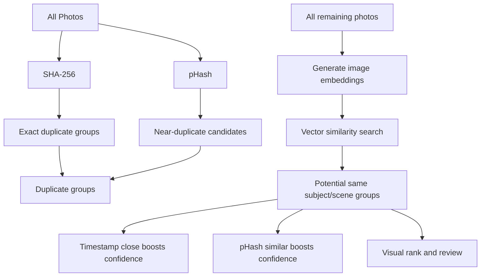

# Photo Assistant

Photo Assistant helps you find exact duplicates, near duplicates, and visually similar photos of the same subject/scene.

## Architecture

## Features

- SHA-256 exact duplicate detection
- pHash near-duplicate grouping via Hamming distance
- Embedding-based scene similarity clustering
- Confidence scoring boosted by timestamp proximity and pHash similarity
- Streamlit review app to pick one photo per group and export decisions

## Install

1. Create and activate a virtual environment.
2. Install dependencies:

   pip install -e .

## Run Review App

streamlit run src/photo_assistant/review_app.py

## Run CLI Analysis

photo-assistant --input /path/to/photos --out analysis_output

This writes CSV files for duplicate groups, scene groups, and review decisions.

## Run Tests

Install development dependencies:

pip install -e ".[dev]"

Run tests:

pytest -q

The suite covers hash grouping, near-duplicate logic, scene confidence scoring, and review/export behaviors.
