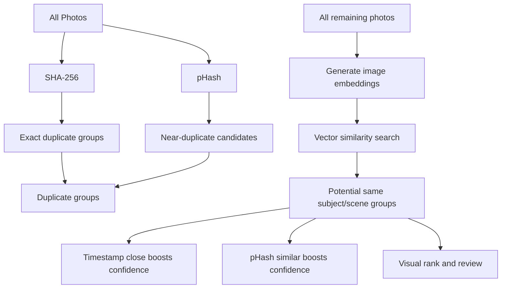
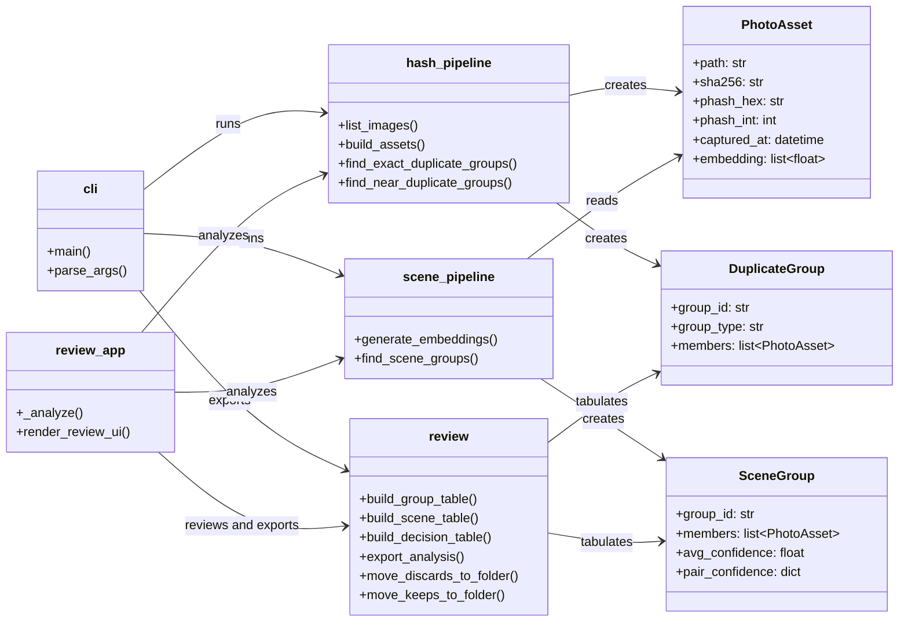
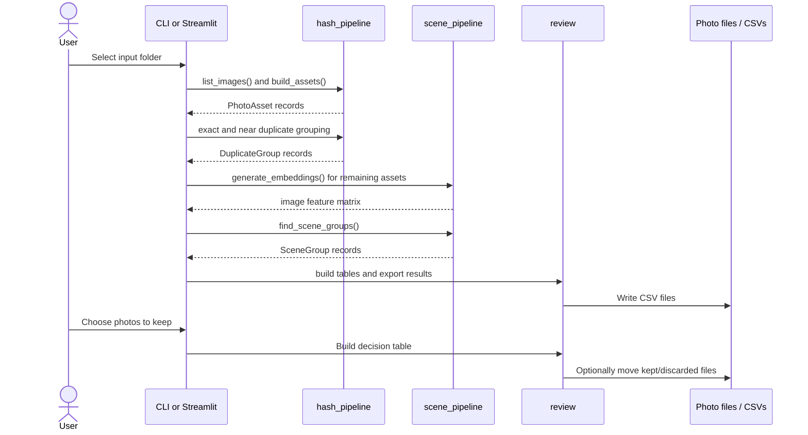

# Photo Assistant

Photo Assistant helps you find exact duplicates, near duplicates, and visually similar photos of the same subject/scene.

## Architecture

### UML package diagram

The package is organized around two entry points, three processing services, and
three dataclasses that carry results between them:

### Runtime flow

Both entry points use the same analysis modules. The command-line interface
exports analysis CSVs, while the Streamlit app additionally presents images,
collects keep/discard choices, and can move files after review.

## Libraries

### Runtime dependencies

| Library | How Photo Assistant uses it |
| --- | --- |
| [Pillow](https://python-pillow.org/) | Opens image files, converts images to RGB, resizes thumbnails for scene features, and reads EXIF capture dates. |
| [ImageHash](https://github.com/JohannesBuchner/imagehash) | Computes perceptual hashes (`pHash`) so visually similar images can be compared with Hamming distance. |
| [NumPy](https://numpy.org/) | Stores image arrays and embedding vectors, calculates grayscale/color features and vector norms, and averages confidence scores. |
| [pandas](https://pandas.pydata.org/) | Builds tabular duplicate, scene, and decision results and writes them to CSV. |
| [scikit-learn](https://scikit-learn.org/) | Provides `NearestNeighbors` with cosine distance to find candidate images that have similar scene embeddings. |
| [Streamlit](https://streamlit.io/) | Supplies the interactive review application: sidebar controls, image previews, selectors, tables, downloads, progress messages, and action buttons. |
| [tqdm](https://tqdm.github.io/) | Declared as a dependency for progress-bar support; the current package code does not directly import it. |

### Python standard library

The project also uses Python's built-in modules: `argparse` parses CLI options;
`pathlib` handles paths and recursive image discovery; `hashlib` computes
SHA-256 file hashes; `dataclasses` defines the result models; `datetime` reads
and compares capture times; `collections.defaultdict` groups records; and
`shutil` moves files selected during review.

### How the analysis works

1. `hash_pipeline.py` recursively finds supported image extensions and creates a `PhotoAsset` for each readable file. Each asset contains a SHA-256 hash, a pHash, and optional EXIF capture time.
2. Exact duplicates share the same SHA-256 value. Near duplicates are grouped when their pHash Hamming distance is at most the configured threshold (8 by default).
3. `scene_pipeline.py` creates a compact, normalized feature vector from a 64-pixel thumbnail: a 16 x 16 grayscale image plus color-channel means and standard deviations. `NearestNeighbors` compares these vectors with cosine distance.
4. Scene confidence can receive small boosts when two photos were captured within two hours or have similar pHashes. Connected matches become `SceneGroup` objects.
5. `review.py` converts groups and user choices into pandas DataFrames. It writes `duplicate_groups.csv`, `scene_groups.csv`, and, when choices are supplied, `review_decisions.csv`. Optional move helpers apply keep/discard decisions while avoiding filename collisions.

## Features

- SHA-256 exact duplicate detection
- pHash near-duplicate grouping via Hamming distance
- Embedding-based scene similarity clustering
- Confidence scoring boosted by timestamp proximity and pHash similarity
- Streamlit review app to pick one photo per group and export decisions

## Install

1. Create and activate a virtual environment.
2. Install dependencies:

   pip install -e .

## Run Review App

streamlit run src/photo_assistant/review_app.py

## Run CLI Analysis

photo-assistant --input /path/to/photos --out analysis_output

This writes CSV files for duplicate groups, scene groups, and review decisions.

## Run Tests

Install development dependencies:

pip install -e ".[dev]"

Run tests:

pytest -q

The suite covers hash grouping, near-duplicate logic, scene confidence scoring, and review/export behaviors.
